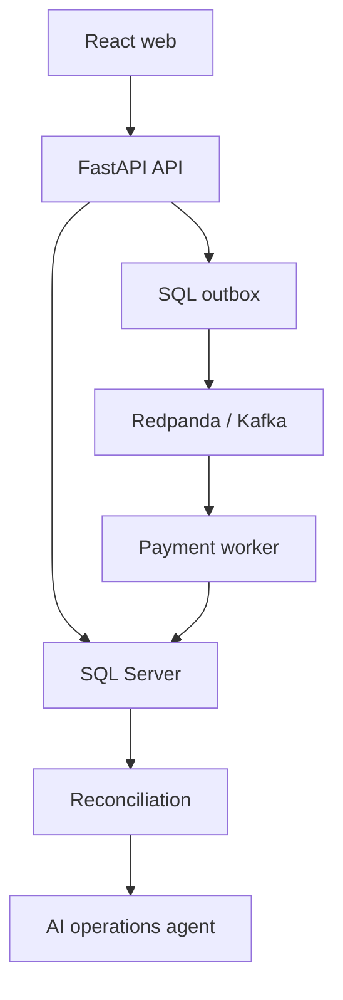

# Fiatium — Build Brief

**Audience:** An autonomous GPT-6 Astra coding agent with access to a development workspace.  
**Owner:** David Pitters  
**Purpose:** A public GitHub portfolio project that demonstrates senior software engineering in a domain distinct from field service.  
**Status:** Implementation brief. Features, benchmarks, deployment claims, and résumé bullets become factual only after they are built and verified.

## 1. Product and portfolio goal

Build a simulated financial operations platform with a React interface, Python services, Microsoft SQL Server, asynchronous payment processing, an immutable double-entry ledger, reconciliation, and an AI operations agent. Docker and Kubernetes must be visible, working parts of the project: reproducible local startup, independent deployables, health probes, autoscaling, rolling updates, recovery from worker failure, and observable traces and metrics.

The product must **never process real payments or collect card data**. A deterministic fake processor simulates authorization, settlement, declines, timeouts, duplicates, and delayed callbacks. The demo is about correctness and operations under failure, not financial compliance certification.

The portfolio story is: David's work experience shows enterprise .NET/business applications; Fiatium shows transferable skill in Python, React, distributed financial workflows, container orchestration, reliability, and agentic AI. Make the repository easy for a recruiter to understand in two minutes and substantial enough for an engineer to inspect deeply.

### Nonnegotiable stack

| Area | Choice |
| --- | --- |
| Web | React, TypeScript, Vite; accessible component library; TanStack Query if useful |
| API and workers | Python, FastAPI, Pydantic, SQLAlchemy, Alembic, pytest |
| System of record | Microsoft SQL Server; Azure SQL for a cloud deployment if available |
| Events | Redpanda/Kafka-compatible broker locally; choose and document a compatible managed option for cloud |
| Containers | Docker, Compose, multi-stage builds, non-root app containers where practical |
| Orchestration | Kubernetes, Helm, local kind or k3d; AKS deployment as an optional verified extension |
| Scale | HPA for suitable stateless services; KEDA for broker-backed payment workers when operationally justified |
| Telemetry | OpenTelemetry traces/metrics/log correlation, Prometheus, Grafana; optional cloud export |
| AI | Model provider behind an interface; tool-calling operations agent with read-only tools first |
| Delivery | GitHub Actions for checks, image builds, manifest validation, and optionally deployment |

Use stable supported versions at implementation time and pin them in lockfiles and image references. Do not claim a cloud deployment, Kubernetes demonstration, scan result, or benchmark unless it actually ran.

## 2. Users and end-to-end demo

An operations analyst can create a simulated customer and invoice, submit a payment with an idempotency key, watch it progress, inspect its journal entry and event timeline, run reconciliation, and ask the AI agent why a payment or settlement is inconsistent. A demo operator can inject a documented failure, observe recovery and scaling in Kubernetes, and approve or reject a proposed event replay.

The headline recorded demonstration should eventually show:

1. A controlled load generator submits many simulated payments with some repeated requests and failures.
2. Worker lag rises; KEDA adds replicas if configured and verified.
3. A worker pod is terminated during processing. Messages may redeliver, but each payment and ledger posting remains unique.
4. Reconciliation exposes an intentionally injected mismatch.
5. The agent investigates using cited internal record IDs and telemetry, proposes a remediation, and waits for an authorized human approval.

Use a workload small enough for a reviewer to reproduce locally. Treat a 50,000-event run as a stretch benchmark requiring measured resources and results, not a default acceptance requirement.

## 3. Domain model and correctness rules

Start with one tenant and CAD, then add tenant isolation. Model `Customer`, `Invoice`, `Payment`, `ProcessorAttempt`, `Account`, `JournalTransaction`, `JournalLine`, `OutboxEvent`, `InboxReceipt`, `ReconciliationRun`, `ReconciliationFinding`, `AgentInvestigation`, and `ActionApproval`. Keep names and ownership precise.

- Store money as **integer minor units** (`BIGINT` cents) with explicit currency. Never use binary floating point. If more currencies are added, define their minor-unit and rounding policy before implementation.
- A posted journal transaction contains at least two lines, is balanced by currency (`sum(debits) == sum(credits)`), and cannot be edited or deleted through the application. Corrections are new reversing and replacement transactions.
- Posting balance must be enforced inside one SQL transaction; application validation alone is insufficient for concurrency. Document the chosen database constraints/transaction design and test them.
- Define the chart of accounts and posting examples explicitly. For a paid invoice, credit Accounts Receivable and debit simulated Cash/Clearing. Avoid treating an authorization alone as settled cash.
- Payment lifecycle must distinguish `initiated`, `processing`, `authorized`, `settled`/`completed`, `failed`, and `refunded` as appropriate. Processor outcome, internal payment record, and ledger posting are separate facts that may temporarily disagree. Reconciliation detects and explains disagreement.
- The fake processor is deterministic from a seeded scenario or explicit simulation flag, so tests can reproduce success, decline, timeout, delayed callback, and duplicate callback.
- A client idempotency key is scoped to tenant and endpoint/operation. Persist the request fingerprint and original outcome; same key plus different payload is a conflict. Concurrency is settled by a SQL uniqueness constraint and transaction, not an in-memory lock. Do not promise identical in-flight responses before defining the wait/retry behavior.
- Publish events via a **transactional outbox** written atomically with the owning SQL state change. Consumers use an inbox/unique business key to tolerate redelivery. Broker delivery is at least once; describe business effects as idempotent, never claim end-to-end exactly-once delivery.
- Define event schema/version, correlation and causation IDs, tenant ID, timestamps, and partition key. Order relevant payment events by payment ID. Consumers handle duplicates, reordering, retries, poison messages, and dead-letter/parking behavior deliberately.
- A reconciliation run compares fake processor records, payment state, and posted journal transactions for a stated time window; it records missing, extra, amount mismatch, and status mismatch findings. It does not silently mutate ledger data.
- Every tenant-facing query and mutation enforces tenant authorization server-side. Tests must show that tenant B cannot see or act on tenant A's data, including through agent tools.

### Core scenarios to prove

| Scenario | Expected invariant |
| --- | --- |
| 50 concurrent same-key payment requests | One payment created; replay semantics documented; conflicting payload rejected |
| Outbox publisher crashes after broker publish but before marking sent | Event can be republished; downstream business effect occurs once |
| Worker dies before acknowledging a message | Another worker retries; one final posting per business operation |
| Processor success arrives twice | One transition and one relevant ledger posting |
| Ledger posting fails after processor success | Payment and processor facts remain inspectable; reconciliation finds the missing journal |
| Refund or correction | New balanced reversing/adjusting journal; original entries preserved |
| Agent sees a discrepancy | It cites records and suggests action; no write without explicit authorization and approval |

## 4. Architecture and boundaries

Do **not** begin with six empty microservices. Build a vertical slice with a web app, a FastAPI application, a payment worker, SQL Server, and broker. Use clear Python modules and separate database ownership boundaries so later extraction is possible. Extract ledger, reconciliation, and agent deployables only when a real independent lifecycle or scaling need is demonstrated. Independent images, probes, deployment values, and telemetry should make the eventual boundaries inspectable.



Start with owned schemas/tables and explicit interfaces, not a shared mutable ORM model imported by all services. If the ledger becomes a separate process, its postings are asynchronous and failures require reconciliation; do not imply a cross-service ACID transaction. A broker is used for workflow decoupling and worker scale, not as the financial source of truth.

Suggested API surface after domain review: customer/invoice creation and listing, `POST /payments` with `Idempotency-Key`, payment status and event history, journal read endpoints, reconciliation runs/findings, investigation requests, and approval/rejection of proposed actions. Generate OpenAPI from the implementation and publish example requests with fake data. Return useful problem responses and correlation IDs.

## 5. AI operations agent

The agent investigates operational inconsistencies, rather than giving financial advice or making accounting decisions. Example: “Why does settlement S-104 not balance?” Its initial tools are read-only, tenant-scoped, bounded, and audited:

- `get_payment`, `get_processor_attempts`, `get_journal_transactions`
- `get_reconciliation_findings`, `get_event_history`, `get_parked_events`
- `get_trace_summary`, `get_worker_metrics`, `get_deployment_status` where available

Produce a structured response with finding, evidence references/IDs, uncertainty, and proposed next step. Tool output is untrusted data; redact secrets and sensitive fields, limit retrieval size, validate arguments, and never send production credentials or raw personal data to a model. Support a mock provider for local reproducibility when no API key is present. Include deterministic agent-tool tests and at least one evaluation set with expected evidence and refusal/uncertainty cases.

Replay or repair is a separate, server-enforced workflow: the agent drafts a specific action; an authorized human reviews and approves a single bounded action; the server rechecks tenant, role, action validity, idempotency, and current state before execution. Record the proposal, approver, tool/action parameters, outcome, and timestamp. A model response is never an authorization. Start with event replay, not direct journal edits or Kubernetes mutations.

## 6. Docker, Kubernetes, and operations requirements

### Docker and Compose

- `docker compose up --build` (with clearly documented prerequisites) starts web, API, worker, SQL Server, broker, and any essential telemetry with seed data. A minimal profile may omit heavy observability services.
- Use health checks and startup dependencies where supported; migrations run deterministically, not as a race among app replicas. Supply `.env.example` without credentials, named data volumes, and a clean reset command.
- Multi-stage and cached builds, pinned base images, `.dockerignore`, minimized runtime dependencies, and non-root application processes where practical. Explain SQL Server container resource and platform requirements; it is a local development dependency, not a production database plan.

### Local Kubernetes first

- Provide a repeatable kind/k3d setup, Helm chart, pinned image tags, values files, and a documented path from fresh cluster to working smoke test.
- Separate migrations as a controlled Job or release step. Configure readiness/liveness/startup probes appropriately, graceful shutdown and message acknowledgement behavior, resource requests/limits, rolling updates, and safe handling of configuration and secrets.
- Demonstrate HPA on a stateless API if meaningful and KEDA scaling workers on broker lag with the necessary metrics and broker configuration. Prove the worker can withstand concurrent replicas and pod termination.
- Use namespace-scoped permissions; if the agent reads Kubernetes status, grant narrowly scoped read-only RBAC to its service account. Never give the model a broad cluster credential.
- Supply a rollback procedure and a failure drill. Record observed commands and outcomes in docs. Do not write an untested claim of zero downtime.
- Keep local SQL Server and broker inside the dev cluster only if resource use is manageable. Prefer managed data services in cloud. AKS, Azure SQL, registry, Key Vault, and infrastructure as code are a later cloud extension gated by cost and actual access.

### Observability and CI

Propagate trace/correlation context across HTTP, outbox, broker, worker, and journal operations. Expose latency, errors, processing lag, retry/dead-letter counts, reconciliation findings, and worker replicas. Provide an importable Grafana dashboard and a few annotated screenshots only after real data exists. Do not log secrets, card numbers, or unbounded prompts.

GitHub Actions on pull requests: Python format/lint/type checks as configured, frontend lint/type/build, unit and focused integration tests, Docker builds, dependency/image scanning, and Helm render/lint checks. Run heavier full-stack, load, and cluster tests on an appropriate schedule or manual workflow if CI resources cannot support them. Publish meaningful status, not fake passing badges.

## 7. Milestones and acceptance gates

Each milestone leaves the repository runnable, documented, and committed. The agent should adapt implementation details based on actual tool access and explain deviations.

1. **Foundation:** README, ADRs for financial model and deployment boundaries, repo scaffold, pinned dependencies, Compose with SQL Server, API, worker, web, migrations, seed data, and CI baseline. Gate: fresh setup works from documented commands.
2. **Ledger and payment vertical slice:** create invoice, submit simulated payment, balanced immutable journal, read UI, idempotency. Gate: scenario and concurrency tests prove the invariants in §3.
3. **Async reliability:** broker, transactional outbox, inbox deduplication, worker retries, parked/dead-letter handling, deterministic fake processor, reconciliation. Gate: crash and duplicate-event tests plus visible discrepancy case.
4. **Container and cluster operations:** optimized Docker builds, local Kubernetes/Helm, probes, resources, rolling release, HPA/KEDA where demonstrated, pod-failure drill. Gate: fresh cluster smoke test and reproducible observations.
5. **Agent and approval:** bounded tools, evidence-backed investigation, mock and configured model provider, human approval for one replay action, audit trail. Gate: authorization and agent evaluation tests, including tenant leakage and unsupported-claim cases.
6. **Portfolio polish:** concise demo script/video, screenshots, architecture and event-flow diagrams, ADRs, API examples, deployment guide, measured load test with machine/configuration and limitations, engineering tradeoffs. Gate: an outsider can run or understand the demo without private services.

Tests should focus on money, concurrency, retries, authorization, and failure behavior. Avoid a vanity test count. Coverage can be reported with context, but is not a goal by itself.

## 8. Repository shape

```text
ledgerflow/
  apps/web/                 React client
  services/api/             FastAPI and domain modules
  services/payment-worker/  broker consumer and fake processor
  services/agent/           extract when justified
  packages/                 narrow shared event contracts only
  db/migrations/            Alembic and SQL-specific safeguards
  infra/compose/            local supporting configuration
  infra/helm/ledgerflow/    chart and values
  infra/terraform/          optional verified cloud phase
  observability/            collector/dashboard configuration
  tests/                    cross-service, load, and E2E scenarios
  docs/adr/                 decisions and tradeoffs
  docs/runbooks/            setup, failure drills, rollback
  .github/workflows/
  compose.yaml
  README.md
```

Keep shared packages small; do not make every service depend on the same database model. Track issues and small reviewable commits. Put substantial architectural decisions in ADRs, including why SQL Server, how ledger invariants are enforced, why broker/outbox is justified, tenant boundary, and when services were extracted.

## 9. README and honest presentation

The first screen should say what the system does, show one real screenshot or concise diagram, and offer **Run locally**, **Watch demo**, and **Architecture** paths. Include prerequisites, exact startup and reset commands, sample credentials if used, API examples, reliability guarantees and limitations, tests, operational drill, security model, measured performance, and tradeoffs at higher scale.

Do not add tools simply to fill keywords. Explain why a tool was used and what simpler design would suffice at smaller scale. Present the project as a simulation. On the résumé, mention only completed and verified features and distinguish local Kubernetes from AKS. Do not claim to have processed real funds or operated a production payment system.

## 10. Instructions to the building agent

Use the companion **Fiatium_Agent_System_Instructions.md** as the system instruction and this file as the user/project brief. Begin by inspecting the actual workspace and available tools, producing a short staged plan, then implement milestone 1 and proceed through subsequent milestones as time and access permit. Make the first runnable vertical slice quickly. Document every blocked external dependency and leave an honest, executable local path. Deliver code, commands used, test outcomes, actual limitations, and next priorities. The system instruction governs work habits; this brief defines the product and acceptance criteria.
