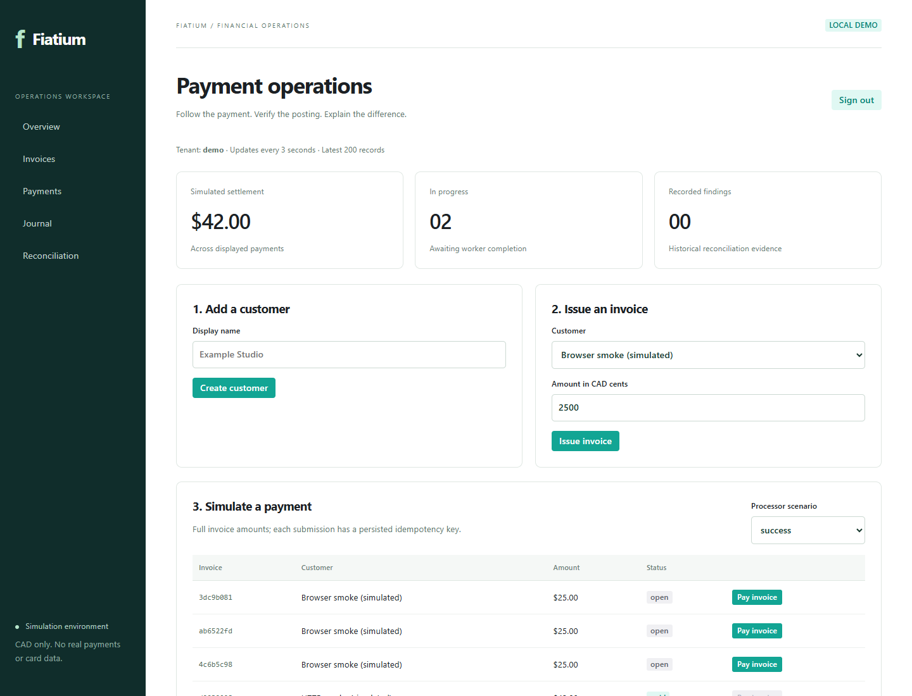
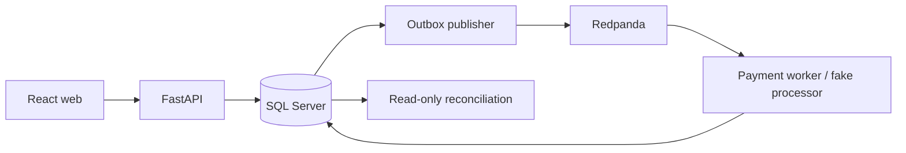

# Fiatium

A simulated payment operations workspace: issue an invoice, submit a payment,
inspect its immutable double-entry journal, and reconcile processor evidence against
internal state. **No real payments, card data, or payment credentials.**

[Run locally](#run-locally) · [Demo walkthrough](docs/runbooks/demo.md) ·
[Architecture](docs/adr/0002-boundaries-and-delivery.md) ·
[Verification record](docs/VERIFICATION.md) · [Work remaining](docs/TASKS.md)





## Current state

Implemented: React/TypeScript UI, authenticated tenant-scoped FastAPI, SQL Server
migrations, customer/invoice/payment journey, immutable balanced postings,
idempotency, deterministic failure scenarios, outbox/inbox, parking, reconciliation,
and full simulated refunds that preserve the original settlement journal.
SQL invariants and concurrency have been tested against real local SQL Server.

Compose and CI are supplied but have not run on this workstation. Actual Kafka
delivery, container startup, restricted SQL user, Kubernetes/Helm, telemetry, AI
investigation/approval, partial refunds/general corrections and cloud deployment remain acceptance
work. See the verification record rather than assuming configuration means success.

## Run locally

### Windows with existing SQL Server (verified development path)

Requirements: Python 3.12, Node 24, pnpm 11.25.0, SQL Server 2022+, ODBC Driver 17,
`sqlcmd`, and a Windows login able to create the dedicated `FiatiumDev` database.
Use a normal user terminal for Windows integrated SQL authentication.

```powershell
py -3.12 -m venv .venv
.venv/Scripts/python.exe -m pip install -r requirements-dev.lock
.venv/Scripts/python.exe -m pip install --no-deps --no-build-isolation -e .
./scripts/init-local.ps1
cd apps/web
pnpm install --frozen-lockfile
pnpm build
cd ../..
./scripts/start-local.ps1
```

Open [Fiatium](http://127.0.0.1:8088). The randomly generated bearer token is the
object key in `FIATIUM_TOKENS` in your ignored `.env` file. It is not a shared default
password. A simulated customer and CAD 125.00 invoice are seeded. After submitting
payments, run the explicit **direct development transport**:

```powershell
.venv/Scripts/python.exe -m fiatium.worker local-once
.venv/Scripts/python.exe scripts/smoke.py --direct
```

The direct transport is useful without a broker; it is not a Kafka reliability test.
To upgrade an existing checkout, stop the API, run
`.venv/Scripts/python.exe -m alembic upgrade head`, rebuild the web app, then restart.
Refunds require migration `0002`; readiness checks that its table is present.
API docs: [OpenAPI UI](http://127.0.0.1:8000/docs). Logs and startup process IDs are in
ignored `artifacts/`. Stop only the API/web process IDs printed by the startup script
using `Stop-Process -Id <api-pid>,<web-pid>` after checking they still refer to these services.
Alternatively run Uvicorn and `pnpm dev` in foreground terminals.

### Docker Compose (provided, not executed here)

Requires Docker Compose v2, Linux x86-64 containers, and approximately 6–8 GB of
available memory for the full development stack. SQL Server containers are a
development dependency; this is not a production database deployment design.

```powershell
py scripts/init-compose.py
docker compose --env-file .env.compose up --build
```

Open port 8080 and use the generated `.env.compose` token. Compose starts SQL Server,
migrations/seed, Redpanda/topic setup, API, outbox publisher, payment worker and web.
The app uses a restricted SQL login; SA is only used for container setup/migrations.
Only web/API/broker development ports are bound to loopback. Do not reuse a live
local API on the same ports. Compose passwords are URL-safe generated values;
arbitrary replacement passwords require correct URL encoding.

Stop with `docker compose --env-file .env.compose down`. **To delete all simulated
Compose data**, add `--volumes`; this destroys the named SQL/broker volumes. Windows
local SQL data is separate and is not touched by that command.

## Verify

```powershell
.venv/Scripts/python.exe -m ruff check services tests db/migrations scripts
.venv/Scripts/python.exe -m ruff format --check services tests db/migrations scripts
$env:FIATIUM_SQL_TESTS='1'
.venv/Scripts/python.exe -m pytest -q
cd apps/web
pnpm build
```

Integration tests create unique test tenants and retain their immutable history in
the selected database. Without `FIATIUM_SQL_TESTS=1`, SQL tests are explicitly skipped.
Point `FIATIUM_DATABASE_URL` at a separate migrated test database if desired. Never
run these tests against a database with real data. CI definitions are not CI results.

## Guarantees and limits

- Money is strict integer CAD cents; full invoice payment only. Invoice debits AR
  and credits revenue; settlement debits simulated cash and credits AR.
- SQL triggers validate balanced postings and reject posted-entry mutations.
- Same-key concurrent requests create one payment. Conflicting payloads return 409;
  successful replays return the stored original 202 body. GET returns current state.
- Transactional outbox plus inbox/business keys make SQL effects idempotent under
  repeat delivery. No distributed exactly-once claim is made.
- Processor success can precede ledger settlement. Reconciliation records missing,
  extra, amount and status discrepancies without repairing them.
- Full refunds create a new AR/cash reversal and reopen the invoice. The fake
  refund receipt and SQL effects commit together; no external refund call is made.
  Inspect a settled payment in the UI, enter a reason and choose the full refund action.
- Demo authentication maps tokens to tenant/role server-side; every tenant API query
  is scoped. Administrative database users remain outside that protection boundary.
- Lists are bounded to recent rows (200 records; 400 journal lines). Reconciliation
  currently scans a tenant's history from 2000 to run start and is intended for small demos.

See [money/posting decisions](docs/adr/0001-money-and-posting.md) and
[delivery boundaries](docs/adr/0002-boundaries-and-delivery.md) for precise scope.
